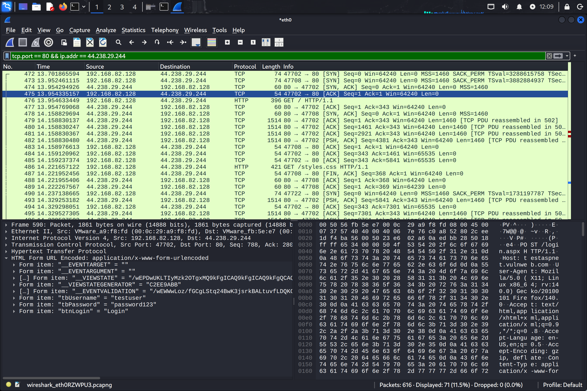
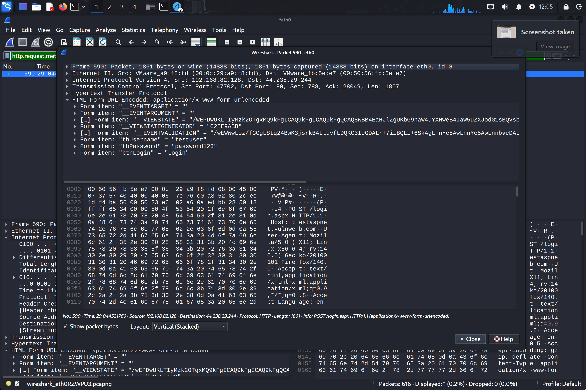
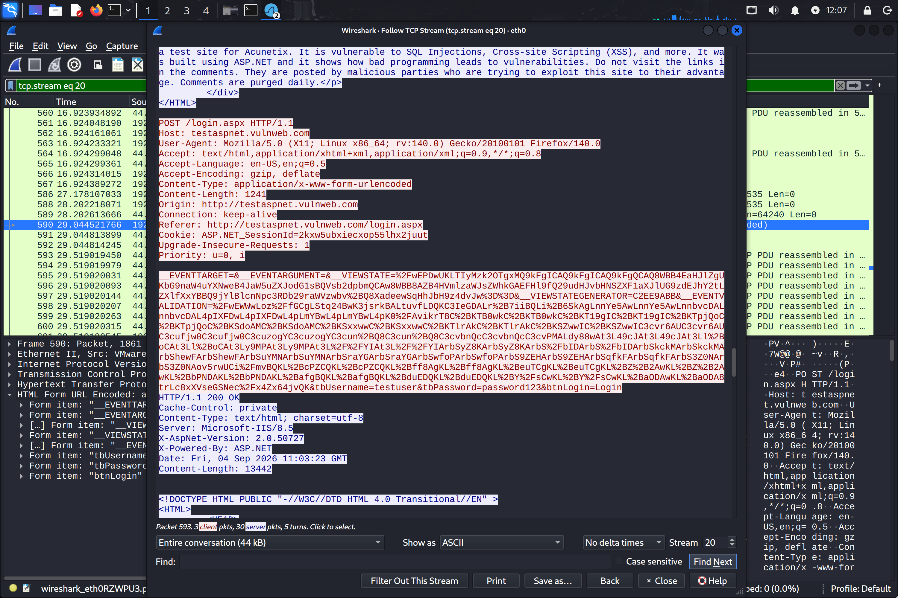

# Lab Evidence: Traffic & Protocol Analysis with Wireshark

Target: http://testaspnet.vulnweb.com/login.aspx (HTTP Port 80)
Client: Kali Linux (192.168.82.128)
Server: 44.238.29.244
Tool: Wireshark v4.6.6 on Linux

---

## 1. TCP 3-Way Handshake Analysis

To establish a stateful connection before transmitting application data, the client and server exchange three control packets:

- Packet 472 (SYN): Client initiates connection from ephemeral port 47702 to server port 80. Relative Sequence Number = 0.
- Packet 474 (SYN, ACK): Server acknowledges connection request. Relative Sequence Number = 0, Acknowledgment Number = 1.
- Packet 475 (ACK): Client confirms connection setup. Relative Sequence Number = 1, Acknowledgment Number = 1. TCP socket is established.

---

## 2. Insecure Transmission & Packet Inspection

An HTTP POST request containing form credentials was submitted to the login endpoint. The capture confirms that HTTP transmits payloads unencrypted:

- Packet Number: 590
- Filter Applied: http.request.method == "POST"
- Decoded Payload (application/x-www-form-urlencoded):
  - tbUsername = "testuser"
  - tbPassword = "password123"
  - btnLogin = "Login"

---

## 3. Full Session Reconstruction (Follow TCP Stream)

Reconstructing TCP stream 20 reveals the full HTTP transaction in plain ASCII:

### Security Impact & Remediation
- Finding: Cleartext transmission of authentication credentials across the local network allows passive observers to intercept access details without breaking cryptography.
- Remediation:
  1. Enforce HTTPS via TLS 1.3 on TCP port 443.
  2. Implement HTTP Strict Transport Security (HSTS) headers to prevent SSL-stripping attacks and force encrypted connections.